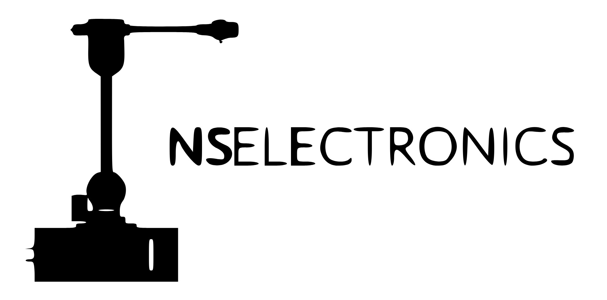
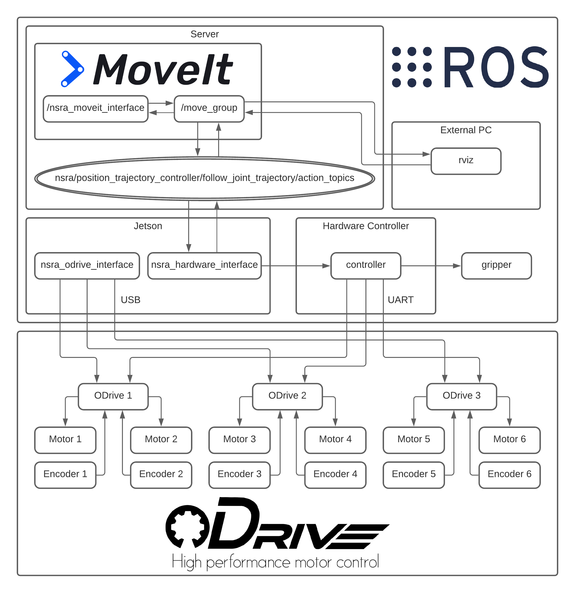
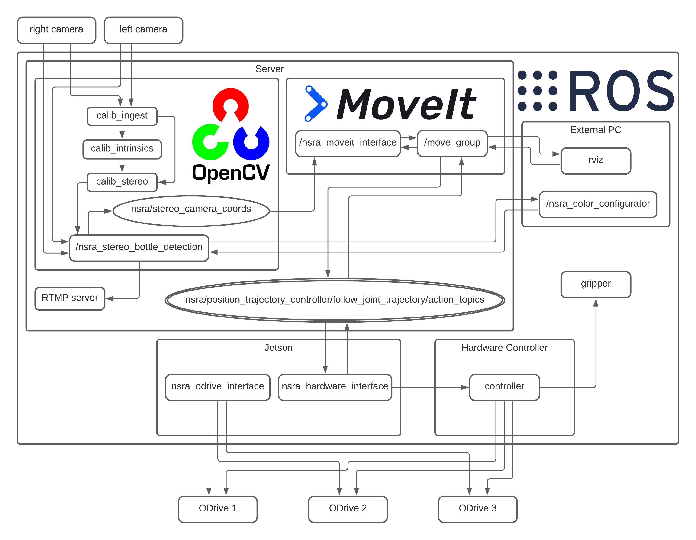

# NS-RobotArm Main Repository

## Software

**System requirements:**

Ubuntu 18.04 LTS

Recommended:

Realtime kernel: https://mirrors.edge.kernel.org/pub/linux/kernel/projects/rt/

**Install:**

```
sudo apt-get install git

git clone https://github.com/Noothless/NS-RobotArm.git

cd ~/NS-RobotArm

./install.sh
```

## Demo Video
Robot Vision Demo: https://youtu.be/qLOjDBZUM-s

## CAD

CAD designs: https://github.com/Noothless/NS-RobotArm_CAD

## EDA

EDA files: https://github.com/Noothless/NS-RobotArm_EDA

## Overview
**Basic inverse kinematics dataflow:**


**NSRA Bottle Detection Demo:**

